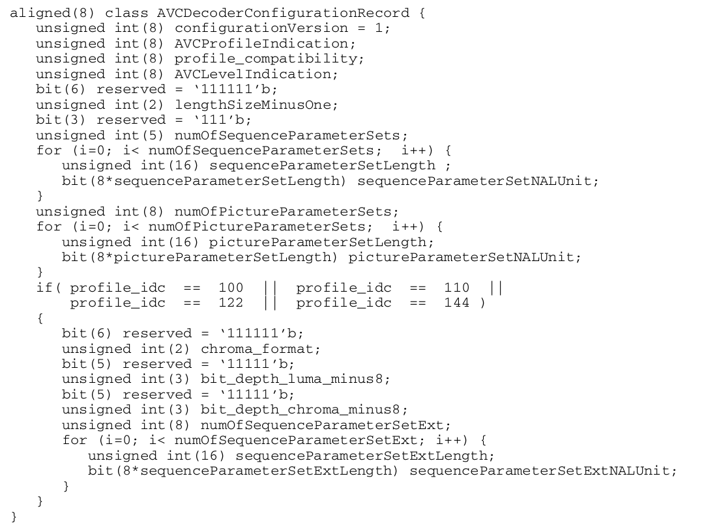

---

# WebTalk — WebRTC / WebCodecs Conference Framework

**A high-performance media conferencing framework built on WebRTC or WebCodecs**

---

## 🚀 Overview

WebTalk is a full-featured real-time media streaming and conferencing framework that supports both **SFU (Selective Forwarding Unit)** and **P2P (Peer-to-Peer)** modes. It bridges WebRTC, RTMP, and HTTP ecosystems with a clean, extensible architecture — perfect for web-based video conferencing, live broadcasting, and real-time collaboration platforms.

---

## 📡 HTTP Distribution

To simplify stream pulling, WebTalk provides an **ES (Elementary Stream) mode** that converts WebRTC streams into raw audio/video data over HTTP.

### 1. HTTP Pull Streaming

HTTP pull streaming extracts WebRTC-pushed streams into raw audio/video data. Inspired by multipart form-data, we've implemented a **custom separator mechanism** for stream delimiting.

**Stream Structure:** The audio/video stream consists of **ESBox** units (simplified MP4-like boxes), with only 4 box types:
- `acnf` — Audio config
- `afrm` — Audio frame
- `vcnf` — Video config
- `vfrm` — Video frame

**Endpoint:** `host/es_streamer/{target}?query...`

**Custom Separator:** Pass `sep=mywebtalk` in the query string (default: `webtalk`)

#### Box Definitions

##### acnf (Audio Config)
```
--------------------------------------------------------------------------------------------
|   SEP(user defined)   |  BoxName(acnf)  |PayloadLen(uint32)|       Payload(Rfc6381)      |
--------------------------------------------------------------------------------------------      
```

##### afrm (Audio Frame)
```
-------------------------------------------------------------------------------------------------
|   SEP(user defined)   |  BoxName(afrm)  |PayloadLen(uint32)|Duration(uint32)|Payload(opus/aac)|
------------------------------------------------------------------------------------------------- 
```

##### vcnf (Video Config)
Payload contains: `width`, `height`, `rfc6381codec`, `avccExtradata`. If your decoder requires Annex-B format, parse SPS/PPS from Extradata.

```
--------------------------------------------------------------------------------------------
|   SEP(user defined)   |  BoxName(vcnf)  |PayloadLen(uint32)|     Payload(DetailBelow)    |
-------------------------------------------------------------------------------------------- 
Payload:
--------------------------------------------------------------------------------------------
|Width(uint16)|Height(uint16)|Rfc6381Len(uint32)|Rfc6381|ExtraDataLen(uint32)|AvccExtraData|
-------------------------------------------------------------------------------------------- 
```

**H264 AVCC Extradata Definition:**


##### vfrm (Video Frame)
Payload contains NAL units **without** Annex-B prefix. 
- For **AVCC** decoders: prepend `uint32` payload length before decoding.
- For **Annex-B** decoders: add Annex-B prefix (`0x00 0x00 0x00 0x01`).

```
------------------------------------------------------------------------------------------------------
|   SEP(user defined)   |  BoxName(vfrm)  |PayloadLen(uint32)|isKey(u8)|Duration(uint32)|Payload(Nal)|
------------------------------------------------------------------------------------------------------ 
```

---

### 2. HTTP Conference (WebRTC ↔ HTTP Gateway)

Based on **HTTP/2.0**, this mode enables web-based push/pull streaming with the same ESBox format as above.

**Endpoint:** `host/es_streamer/{target}?query...`  
**Custom Separator:** Same as HTTP pull streaming (`sep` parameter)

All box formats (`acnf`, `afrm`, `vcnf`, `vfrm`) are identical to the HTTP pull streaming specification above.

---

## 🌐 WebRTC Module

### 1. SFU Mode (Selective Forwarding Unit)

SFU mode exchanges signaling via **HTTP REST APIs** — implementing **WHIP** (WebRTC HTTP Ingest Protocol) and **WHEP** (WebRTC HTTP Egress Protocol).

**Port Modes:**
- **Greedy Mode:** Opens ports based on available network interfaces (maximizes connectivity).
- **Port-Saving Mode:** Opens only the minimum ports requested by clients (conserves resources).

Both modes share the same API design.

#### API Endpoints

**PATH:** `/publish`  
**METHOD:** POST  
**DESC:** Push stream (WHIP)  
**PAYLOAD:**
```
-----------------------------------------------------------------------------------------
|   FIELD      |   TYPE         | NULLABLE  |   COMMENT                                |
-----------------------------------------------------------------------------------------    
| token        | unsigned int   | Y         | Unique task ID; auto-generated if empty   |
| sockets      | unsigned int   | Y         | Requested ports (default: 1)             |
| peer         | String         | N         | Base64-encoded SDP offer                |
```
**RETURN:**
```
-----------------------------------------------------------------------------------------
|   FIELD      |   TYPE         | NULLABLE  |   COMMENT                                |
-----------------------------------------------------------------------------------------    
| success      | bool           | N         | Operation status                         |
| sid          | unsigned int   | N         | Task ID                                  |
| data         | String         | N         | Base64-encoded SDP answer               |
```

**PATH:** `/subscribe`  
**METHOD:** POST  
**DESC:** Pull stream (WHEP)  
**PAYLOAD:**
```
-----------------------------------------------------------------------------------------
|   FIELD      |   TYPE         | NULLABLE  |   COMMENT                                |
-----------------------------------------------------------------------------------------    
| target       | unsigned int   | N         | Target task ID (required)               |
| sockets      | unsigned int   | Y         | Requested ports (default: 1)            |
| peer         | String         | N         | Base64-encoded SDP offer               |
```
**RETURN:** Same as `/publish`

**PATH:** `/publish_subscribe`  
**METHOD:** POST  
**DESC:** Both push and pull simultaneously  
**PAYLOAD:**
```
-----------------------------------------------------------------------------------------
|   FIELD      |   TYPE         | NULLABLE  |   COMMENT                                |
-----------------------------------------------------------------------------------------    
| token        | unsigned int   | Y         | Push task ID; auto-generated if empty    |
| target       | unsigned int   | N         | Pull target task ID (required)          |
| sockets      | unsigned int   | Y         | Requested ports (default: 1)            |
| peer         | String         | N         | Base64-encoded SDP offer               |
```
**RETURN:** Same as `/publish`

---

### 2. P2P Mode (Peer-to-Peer)

P2P mode uses **WebSocket** for signaling exchange, enabling direct communication between multiple endpoints. The server **does not forward media** — it only handles signaling.

> ⚠️ **Note:** One WebSocket connection supports **one WebRTC peer connection at a time**.

#### WebSocket Message Formats

**SDP Message:**
```
-----------------------------------------------------------------------------------------
|   FIELD      |   TYPE         | NULLABLE  |   COMMENT                                |
-----------------------------------------------------------------------------------------    
| sid          | unsigned int   | Y         | Session ID (unique per pair)            |
| type         | String         | N         | "offer" or "answer"                     |
| sdp          | String         | N         | WebRTC SDP signaling                    |
```

**ICE Candidate Message:**
```
-----------------------------------------------------------------------------------------
|   FIELD      |   TYPE         | NULLABLE  |   COMMENT                                |
-----------------------------------------------------------------------------------------    
| type         | String         | N         | "iceCandidate"                          |
| candidate    | Candidate      | Y         | ICE candidate structure; empty = done  |
```

**Candidate Structure:**
```
-----------------------------------------------------------------------------------------
|   FIELD           |   TYPE           | NULLABLE  |   COMMENT                          |
-----------------------------------------------------------------------------------------    
| candidate         | String           | N         | UDP port parameters                |
| sdpMid            | String           | Y         | SDP media index                    |
| sdpMlineIndex     | unsigned short   | Y         | SDP m-line position                |
| usernameFragment  | String           | Y         | Unique ufrag configuration         |
```

**StopTalk Message:**
```
-----------------------------------------------------------------------------------------
|   FIELD      |   TYPE         | NULLABLE  |   COMMENT                                |
-----------------------------------------------------------------------------------------    
| type         | String         | N         | "stopTalk"                              |
| sid          | String         | N         | Session ID (unique)                     |
```

---

### 3. Management APIs

**PATH:** `/sessions`  
**METHOD:** GET  
**DESC:** View active SFU sessions  
**RETURN:**
```
-----------------------------------------------------------------------------------------
|   FIELD      |   TYPE                      | NULLABLE  |   COMMENT                   |
-----------------------------------------------------------------------------------------    
| success      | bool                        | N         | Operation status            |
| sessions     | HashMap<id, RtcSession>     | N         | SFU session list            |
```

**RtcSession Structure:**
```
-----------------------------------------------------------------------------------------
|   FIELD      |   TYPE               | NULLABLE  |   COMMENT                           |
-----------------------------------------------------------------------------------------    
| id           | unsigned int         | N         | Unique task ID                     |
| sockets      | list<unsigned int>   | N         | Ports used (port-saving mode)      |
| listeners    | list<String>         | N         | Pullers (client socket addresses)  |
| elapsed      | unsigned long        | N         | Session age (seconds)              |
```

**PATH:** `/p2p_sessions`  
**METHOD:** GET  
**DESC:** View active P2P sessions *(TBD)*

---

### 4. STUN / TURN Services

WebTalk includes built-in STUN/TURN servers. Configure via environment variables:

```
PEER_STUN_ADDRS=10.10.87.239:9013   # External address (for container deployments)
STUN_ADDR=0.0.0.0:9013              # STUN server socket
TURN_ADDR=0.0.0.0:9012              # TURN server socket
TURN_USERS="robin=12345"            # TURN credentials (user=password)
```

---

### 5. Business System Integration

WebTalk integrates with external systems via **MQ** (Message Queue) topics:

| Topic               | Key         | Description                                    |
|---------------------|-------------|------------------------------------------------|
| `boeshare_stream`   | `up`        | Pusher has started streaming                  |
|                     | `down`      | Pusher has stopped streaming                  |
|                     | `unstable`  | Pusher socket instability detected            |
| `boeshare_listener` | `up`        | Puller has started pulling                    |
|                     | `down`      | Puller has disconnected                       |
|                     | `unstable`  | Puller socket instability detected            |

**Message Format (boeshare_stream):**
```
-----------------------------------------------------------------------------------------
|   FIELD      |   TYPE         | NULLABLE  |   COMMENT                                |
-----------------------------------------------------------------------------------------    
| token        | unsigned int   | N         | Task ID                                  |
```

**Message Format (boeshare_listener):**
```
-----------------------------------------------------------------------------------------
|   FIELD      |   TYPE         | NULLABLE  |   COMMENT                                |
-----------------------------------------------------------------------------------------    
| token        | unsigned int   | N         | Task ID                                  |
| addr         | String         | N         | Client HTTP socket address              |
```

---

## 📺 RTMP Module

**Status:** *TBD* — Plans to support WebRTC ↔ RTMP conversion.

---

## 🛠️ Build & Deploy

```bash
./build.sh
zip webtalk.zip webtalk
scp -P 17822 ./webtalk.zip root@47.92.124.142:/data/webtalk/
ssh -p 17822 root@47.92.124.142
```

---

## 📦 fMP4 Format

**AVCC Format:** `len = nal_len + 4` (4-byte length prefix before each NAL unit)

---

## 💡 Why WebTalk?

- ✅ **Dual-mode architecture** — SFU for scalability, P2P for low-latency.
- ✅ **HTTP/WebSocket gateways** — bridge WebRTC with traditional web clients.
- ✅ **Built-in STUN/TURN** — no external dependencies.
- ✅ **Business-system ready** — MQ integration for monitoring and orchestration.
- ✅ **Flexible port management** — save resources or maximize connectivity.
- ✅ **Clean ESBox protocol** — simple, extensible, and human-readable.

---

**⭐ Star this repo if you find WebTalk useful — contributions and feedback are always welcome!**